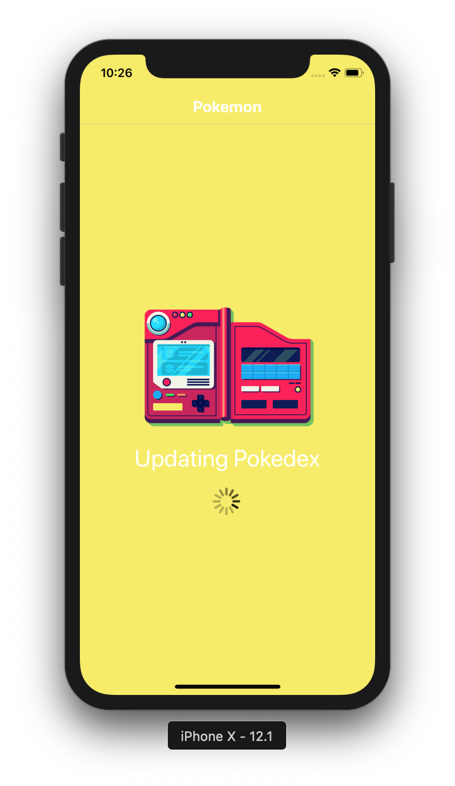

# Random-Pokemon

## How to run:

### Prerequisites:

- Node
- Expo Cli
- ios or android simulator or expo app installed on mobile device

### Command Line Instructions:

- After cloning repository type the command "cd random-pokemon/" to get into the mobile app folder
- Type the command "npm install" in terminal to install the dependencies
- Type the command "npm start" in terminal to start running the mobile app
- Type "i" for ios simulator or "a" for android simulator in terminal or open Expo app on mobile device and scan QR code on Expo CLI

## Screenshots:

  
  
  
  
  

